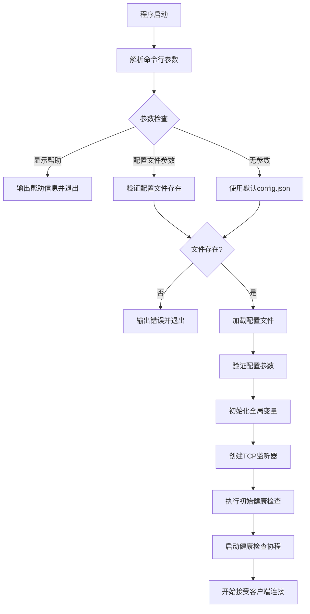
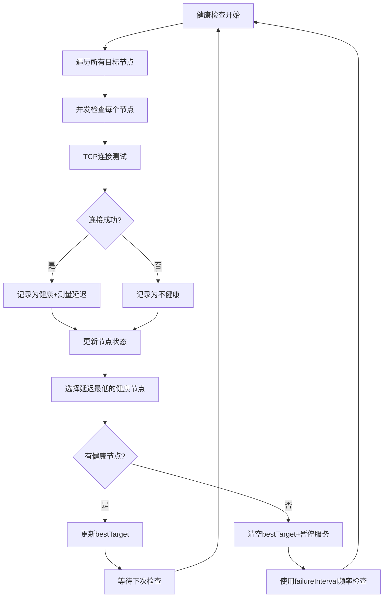
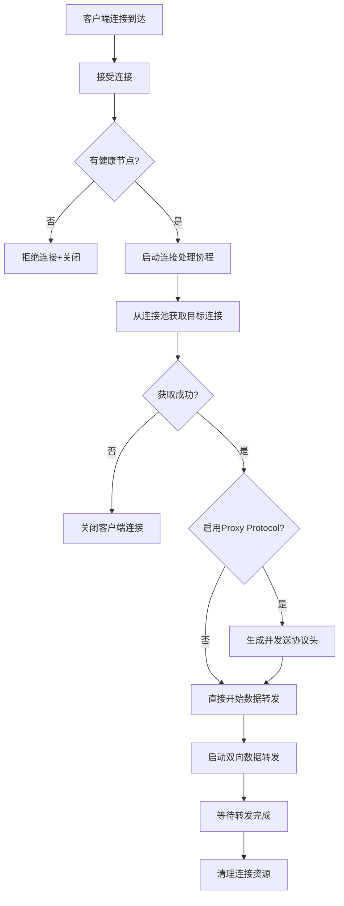
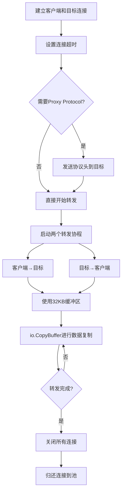

# Go TCP 代理程序工作流程

## 程序概述

这是一个基于Go语言开发的TCP代理服务器，具有智能节点选择、健康检查、连接池管理和Proxy Protocol支持功能。程序能够自动选择延迟最低的健康节点进行流量转发，并在所有节点失败时暂停服务直到节点恢复。

## 核心组件

### 1. 配置管理 (main.go)
- **Config结构体**: 定义配置文件格式
- **loadConfig函数**: 加载和验证JSON配置文件

### 2. 节点健康管理 (main.go)
- **NodeHealth结构体**: 存储节点健康状态和延迟信息
- **checkNodeHealth函数**: 检查节点连通性并测量延迟
- **全局变量**: nodeHealths映射存储所有节点状态

### 3. 代理转发 (proxy.go)
- **连接池管理**: TargetPool结构体复用TCP连接
- **Proxy Protocol支持**: 支持v1和v2版本
- **流量转发**: 双向数据传输

## 详细工作流程

### 启动阶段



#### 1.1 配置文件加载
程序使用标准的命令行参数方式指定配置文件：

**命令行参数**：
- `-c <文件路径>`: 指定配置文件路径
- `-h` 或 `-help`: 显示帮助信息
- 无参数：使用默认的`config.json`文件

**配置文件处理逻辑**：
1. 解析命令行参数（使用Go标准flag包）
2. 验证指定的配置文件是否存在
3. 如果文件不存在，程序退出并显示错误信息
4. 输出实际使用的配置文件路径到日志

**配置验证**：
解析JSON配置文件，验证必需字段：
- `bindAddr`: 监听地址（必需）
- `targets`: 目标服务器列表（必需）
- `updateInterval`: 健康检查间隔（必需，>0）
- `failureInterval`: 故障检查间隔（可选，默认5秒）
- `proxyProtocol`: Proxy Protocol版本（可选）

#### 1.2 初始化过程
- 创建节点健康状态映射`nodeHealths`
- 初始化互斥锁用于并发安全
- 绑定监听端口
- 执行第一次健康检查选择最优节点

### 健康检查循环



#### 2.1 节点健康检测
对每个目标节点执行以下步骤：
1. **连接测试**: 使用`net.DialTimeout`建立TCP连接（5秒超时）
2. **延迟测量**: 记录连接建立耗时
3. **状态更新**: 更新NodeHealth结构体
4. **日志记录**: 输出节点状态和延迟信息

#### 2.2 最优节点选择
- 筛选所有健康节点
- 按延迟排序，选择延迟最低的节点作为`bestTarget`
- 如果所有节点都失败，清空`bestTarget`并暂停转发服务

#### 2.3 动态检查间隔
- **正常模式**: 使用`updateInterval`间隔（如60秒）
- **故障模式**: 当所有节点失败时，使用`failureInterval`间隔（如10秒）进行更频繁检查

### 客户端连接处理



#### 3.1 连接接受
- TCP监听器持续等待客户端连接
- 每个新连接启动独立的协程处理
- 在连接处理前检查是否有健康的目标节点

#### 3.2 连接池管理
- **TargetPool**: 为每个目标地址维护连接池
- **连接复用**: 尽可能复用现有TCP连接减少建立开销
- **连接验证**: 从池中获取连接时验证连接有效性
- **连接归还**: 转发完成后将可用连接归还池中

#### 3.3 Proxy Protocol处理
根据配置生成相应版本的协议头：

**v1版本（文本格式）**:
```
PROXY TCP4 客户端IP 目标IP 客户端端口 目标端口\r\n
```

**v2版本（二进制格式）**:
- 12字节固定签名
- 1字节版本和命令
- 1字节协议族和传输协议
- 2字节地址长度
- 变长地址信息（IPv4: 12字节，IPv6: 36字节）

### 数据转发机制



#### 4.1 双向转发
- **并发处理**: 使用两个协程分别处理上行和下行数据
- **缓冲优化**: 使用32KB缓冲区提高传输效率
- **错误处理**: 捕获并记录转发过程中的异常
- **连接管理**: 任一方向出错时立即关闭双向连接

#### 4.2 超时和资源管理
- **连接超时**: 设置30秒连接超时防止僵死连接
- **优雅关闭**: 使用WaitGroup等待所有转发协程完成
- **资源清理**: 确保连接正确关闭和归还连接池

## 故障处理机制

### 1. 节点故障检测
- **实时监控**: 定期健康检查识别故障节点
- **自动切换**: 故障节点自动从服务中移除
- **故障恢复**: 自动检测并重新启用恢复的节点

### 2. 全局故障模式
- **服务暂停**: 所有节点失败时拒绝新连接
- **加速检测**: 使用更短的检查间隔快速检测恢复
- **状态通知**: 清晰的日志提示当前服务状态

### 3. 连接级故障处理
- **连接验证**: 从池中获取连接时验证可用性
- **重试机制**: 连接失败时尝试建立新连接
- **优雅降级**: 单个连接失败不影响其他连接

## 性能优化特性

### 1. 连接池机制
- **连接复用**: 减少TCP握手开销
- **池化管理**: 每个目标维护独立连接池
- **动态调整**: 根据需求自动创建和回收连接

### 2. 并发处理
- **协程模型**: 每个客户端连接使用独立协程
- **非阻塞**: 健康检查和数据转发并行执行
- **资源隔离**: 单个连接问题不影响整体服务

### 3. 智能路由
- **延迟优化**: 自动选择延迟最低的目标节点
- **负载感知**: 基于实时健康状态进行路由决策
- **动态调整**: 根据网络条件自动调整目标选择

## 监控和日志

### 1. 详细日志记录
- **节点状态**: 记录每次健康检查结果和延迟
- **连接信息**: 记录客户端连接和转发状态
- **错误跟踪**: 详细记录各类异常和故障信息

### 2. 状态报告
- **最优节点**: 显示当前选择的最优目标
- **健康统计**: 显示健康节点数量和总节点数
- **协议状态**: 显示Proxy Protocol启用状态

### 3. 运行时监控
- **实时状态**: 通过日志实时了解服务运行状态
- **故障告警**: 节点故障和服务异常的及时通知
- **性能指标**: 延迟测量和连接统计信息

## 配置示例1

```json
{
    "bindAddr": ":8080",
    "targets": ["111.2.3.114:14", "166.88.90.90:22"],
    "updateInterval": 60,
    "failureInterval": 10,
    "proxyProtocol": ""
}
```

此配置将在8080端口启动代理服务，在两个目标节点间进行智能路由，每60秒检查一次健康状态，故障时每10秒检查一次，不启用Proxy Protocol v2,直接转发数据。

## 配置示例2

```json
{
    "bindAddr": ":8080",
    "targets": ["143.198.210.114:14", "45.207.219.191:22"],
    "updateInterval": 60,
    "failureInterval": 5,
    "proxyProtocol": "v2"
}
```

此配置将在8080端口启动代理服务，在两个目标节点间进行智能路由，每60秒检查一次健康状态，故障时每5秒检查一次，并启用Proxy Protocol v2。

## 使用方式

### 1. 使用默认配置文件
```bash
./ForwardOptimal
```
使用当前目录下的 `config.json` 文件

### 2. 指定配置文件（推荐方式）
```bash
./ForwardOptimal -c /root/a.json
```
使用 `-c` 参数指定任意配置文件路径

### 3. 更多示例
```bash
# 使用相对路径
./ForwardOptimal -c ./configs/production.json
./ForwardOptimal -c ../config/dev.json

# 使用绝对路径
./ForwardOptimal -c /etc/go-tcp/production.json
./ForwardOptimal -c /home/user/configs/test.json
```

### 4. 显示帮助信息
```bash
./ForwardOptimal -h
./ForwardOptimal -help
```

### 5. 显示版本信息
```bash
./ForwardOptimal -v
./ForwardOptimal -version
```

### 6. Windows系统示例
```cmd
ForwardOptimal.exe -c C:\configs\production.json
ForwardOptimal.exe -c C:\app\config.json
```

### 7. 帮助信息输出示例
```
Go TCP 代理程序 - 智能负载均衡TCP转发服务

用法:
  ./ForwardOptimal [选项]

选项:
  -c <文件路径>    指定配置文件路径 (默认: config.json)
  -h, -help       显示此帮助信息
  -v, -version    显示版本信息

示例:
  ./ForwardOptimal                           # 使用默认配置文件 config.json
  ./ForwardOptimal -c /root/a.json          # 使用指定的配置文件
  ./ForwardOptimal -c ./configs/prod.json   # 使用相对路径配置文件
```

程序启动时会在日志中显示实际使用的配置文件路径，便于确认配置文件加载情况。

## 新增功能特性

### 1. 美化的启动界面
程序启动时会显示精美的ASCII艺术横幅，包含版本信息和功能特性说明。

### 2. 增强的日志系统
- **彩色表情符号**: 使用 ✅ ❌ 🔗 等符号增强日志可读性
- **详细状态报告**: 每次健康检查后显示完整的节点状态表
- **分类日志信息**: 区分不同类型的操作和状态
- **时间戳显示**: 健康检查报告包含准确的时间信息

### 3. 版本信息管理
- **版本显示**: 支持 `-v` 和 `-version` 参数显示版本信息
- **构建信息**: 包含构建日期和作者信息
- **帮助系统**: 完善的命令行帮助信息

### 4. 改进的状态监控
- **实时节点状态**: 详细显示每个节点的在线/离线状态和延迟
- **服务状态指示**: 清晰显示服务是否正常运行或已暂停
- **连接统计**: 显示新连接建立和失败信息

### 5. 示例日志输出
```
╔══════════════════════════════════════════════════════════╗
║              ForwardOptimal v1.0.0                      ║
║         智能负载均衡TCP转发代理服务器                   ║
║                                                          ║
║  特性: 健康检查 | 智能路由 | 连接池 | Proxy Protocol    ║
║  作者: Go TCP Forward         构建: 2024-01-01        ║
╚══════════════════════════════════════════════════════════╝

🚀 程序启动中...
📁 配置文件: config.json
✅ 配置加载成功
🌐 监听地址: :8080
🎯 目标节点: [143.198.210.114:14 45.207.219.191:22]
⏱️  检查间隔: 60秒 (故障时: 10秒)
🔗 Proxy Protocol: v2
🎉 TCP转发服务器启动成功!
🔗 监听地址: :8080
🎯 目标节点数量: 2

==============================
节点健康检查报告 - 2024-01-01 12:00:00
✓ 最优目标: 143.198.210.114:14 (延迟: 50ms)
✓ 健康节点: 2/2
✓ 服务状态: 正常运行
✓ 下次检查: 60秒后
✓ Proxy Protocol: v2
--- 节点详细状态 ---
  ✅ 在线 143.198.210.114:14 (延迟: 50ms)
  ✅ 在线 45.207.219.191:22 (延迟: 80ms)
==============================
```
